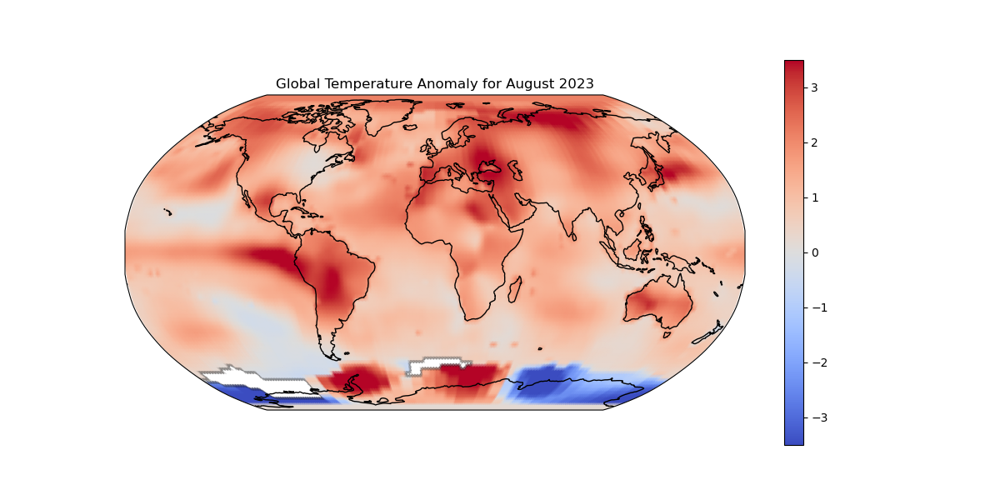
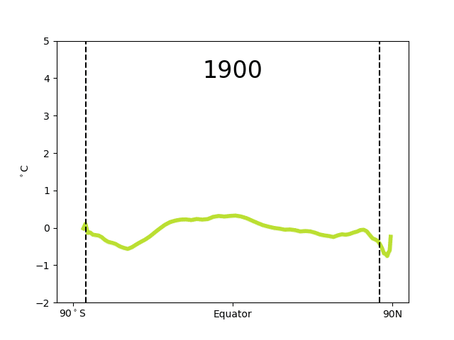

# OpenScienceExample_GISTEMPv4

An example of an open, reproducible research result for a work-in-progress animation

In September 2023, there was an online article that [NASA Announces Summer 2023 Hottest on Record](https://www.nasa.gov/news-release/nasa-announces-summer-2023-hottest-on-record/).

Using NASA’s GISS Surface Temperature Analysis (GISTEMP v4) dataset let’s explore this dataset and create an open, reproducible result showing how the global temperature have been changing since 1900.

As an example of excellent open science using X/Twitter, Blog posts, and GitHub see the work of https://zacklabe.com/ who routine posts visualizations of this and other climate related datasets. Here is an intriguing animation based on the Berkeley Earth Surface Temperatures (BEST; http://berkeleyearth.org/data/.  Let’s set ourselves the task of creating a similar visualization based on the GISTEMP v4 data using the BEST visualization as inspiration.  

This repository represents a work-in-progress by James Munroe trying to visualize how global temperatures (varying with latitude), as given by the GISTEMPv4 dataset, have evolved for the last 120 years.

This visualization is by no means perfect but is the output of working session that to be shared with the wider community as an open science example.

Open questions:
- Am I doing the averaging/resample in time correctly?
- Am I correctly calculating how the areas changes with latitude
- Comparing with this [animation](https://zacklabe.files.wordpress.com/2023/02/zonal_surfaceairtemperature_best_2022.gif) , the general trends are similar but they are noticeably different from my time series animation. Is this because the BEST and GISTEMP datasets are different or is it due to an error in my visualization code? 
- How could I improve the styling of the figures to improve their readability?

